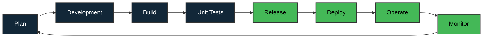

# Salut 👋, moi c'est Davy ROBERT
## 💻 Développeur Full Stack Web & Mobile

<h2 style="text-align: left;"><b>🚀 Liens rapides</b></h2>

<ul>
<li><a href="#about">🧾 A propos</a></li>
<li><a href="#parcours">✒️ Parcours et Appétences</a></li>
<li><a href="#stacks">⚒️ Technos & Outils</a></li>
<li><a href="#projects">🚀 Mes Projets</a></li>
<li><a href="#method">🔎 Méthodes & Organisations</a></li>
<li><a href="#resume">👉 Pour résumer</a></li>
<li><a href="#contact">✉️ Comment me contacter ❓</a></li>
</ul>

<!-- 
 

 -->

---

<h2 id="about" style="text-align: left;"><b>📎 A propos</b></h2>
<ul>
<li>🎓 <b>Concepteur Développeur d'Applications</b> (RNCP37873, Niveau 6, +3/4)</li>
<li>🎓 <b>Développeur Web et Web mobile</b> (RNCP37873, Niveau 5, +2)</li>
<li>👉 <b>Ce que j'apporte</b> : 

- La conception d'applications performantes, accessibles et maintenables. 
- Mon goût prononcé pour l'apprentissage, mon envie de contribuer à des projets qui ont du sens, porteurs de transformations avec une véritable utilité. 
- Une vision globale et une capacité d'analyse alignées avec les objectifs métiers et avec la cohérence des solutions développées.
- J'aime aller jusqu'au bout des choses, comprendre et analyser des problématiques, avoir ce sentiment d'accomplissement et faire les choses bien, le tout en prenant soin de m'organiser correctement.</li>

<li>🎯 <b>Mes objectifs</b> : Animé par une curiosité et une véritable volonté d'apprentissage, de découverte et d'exploration, je souhaite relever de nouveaux défis professionnels et techniques. Je recherche une équipe qui partage la même dynamique et une entreprise aux valeurs fortes, dans laquelle je pourrais pleinement m'investir.</li>

<li>🔎 <b>En formation continue</b> et en veille régulière sur les dernières technologies.
<li><b>📌 Disponible pour :</b> CDI / CDD / Portage Salarial</li>
</ul>

 

<h2 id="parcours" style="text-align: left;"><b>✒️ Parcours et Appétences</b></h2>

Mon parcours m’a permis d’évoluer sur un large spectre du développement web, me conduisant naturellement vers un profil full stack.

Ces expériences se sont révélées très enrichissantes et m’ont permis d’acquérir une vision globale du cycle de vie d’une application 👌.

Avec le recul, je considère cette polyvalence comme un véritable atout 👍, car elle m’a permis de comprendre les interactions entre les différentes couches d’un projet du front au back, jusqu’à la mise en production.

Aujourd’hui, mon objectif est de continuer à consolider cette expertise à travers des projets concrets et utiles, en renforçant mes compétences sur l’ensemble des stacks techniques requises.

Toujours en veille technologique, je me forme en continu afin d’évoluer avec les standards du développement moderne.

Pour découvrir les projets liés à ces expériences, c’est <a href="#projects"> 👉 ici 👈</a>.

 

<h2 id="stacks" style="text-align: left; font-weight: bold">⚒️ Stacks & Outils</h2>

**UI/UX Design** :  

**Front-end** :      

**Back-end** :   

**Base de données** :   

**API** :  

**Mobile** :    

**Tests** :   

**Versioning** :     

**Archi & Infra** :   

**DevOps** :   

 

 <h2 id="projects">🚀 Mes Projets :</h2>

- 🏢 **[Ecosystem](https://www.davyrobert.fr/fr/projects/ecosystem-qvmd)** - Plateforme de mise en relation entre prestataires et détenteurs de déchets 🔹 *(Angular, Typescript, .NET, C#)* 🔹

- 🧠 **[MakeSense](https://www.davyrobert.fr/fr/projects/makesense)** - Application de création de prise de décision pour l'association. Le but étant de passer à l'action et de construire une société inclusive et durable 🔹 *(React, Vite.js, Node.js, MySQL)* 🔹

- 🏠 **[WildRent](https://www.davyrobert.fr/fr/projects/wildrent)** - Platforme de location d'équipements et d'activité outdoors / indoors 🔹 *(Next.js, Typescript, TailwindCSS, GraphQL)* 🔹

- 💼 **[MyCritJob](https://www.davyrobert.fr/fr/projects/crit-job)** - Application mobile de recherche d'emploi et de gestion administrative 🔹 *(Java, Kotlin)* 🔹

- ⚡ **[Eurowatt-Super7](https://www.davyrobert.fr/fr/projects/eurowatt-super7)** - Solution de gestion énergétique innovante 🔹 *(PHP, Symfony, PostgreSQL)* 🔹

- 🎨 **[Virtual Met Art](https://www.davyrobert.fr/fr/projects/virtual-met-art)** - Expérience immersive d'art virtuel et métavers 🔹 *(React, Vite.js, TailwindCSS, REST API)* 🔹
 
- 🇫🇷 **[France Trivia Quiz](https://www.davyrobert.fr/fr/projects/france-trivia)** - Jeu de quiz interactif sur la culture française 🔹 *(Javascript, HTML, CSS)* 🔹

- 📝 **[Blog Project JS](https://www.davyrobert.fr/fr/projects/blog-project-js)** - Blog moderne de création de post 🔹 *(Javascript, SCSS, Node.js, WebPack)* 🔹

- 👜 **[Louis Vuitton](https://www.davyrobert.fr/fr/projects/louisvuitton)** - Marque de luxe connue pour ses collections haut de gamme 🔹 *(React, Sharepoint, Webpack)* 🔹

 

<h2 id="method" style="text-align: left; font-weight: bold">🔎 Méthodes & Organisations</h2>

J'ai l'habitude de travailler sur chacun de mes projets en utilisant la [**Méthode Agile Scrum**](https://asana.com/fr/resources/sprint-planning-meeting).
  Le diagramme suivant que j'ai réalisé montre le cycle de sprint que j'utilise selon l'approche Devops :
    

  

<!-- 
   -->

 

<h2 id="resume" style="text-align: left; font-weight: bold">👉 Pour résumer</h2>

 <strong>Vous recherchez un développeur web, un intégrateur web ou un développeur mobile ?</strong>

<i> Discutons ensemble de la valeur que je peux apporter à vos projets en prenant en compte vos réels besoins sur un aspect concret et pragmatique.</i>   

Examinons dans quelle mesure vos critères sont compatibles avec les miens et peuvent correspondre à nos attentes respectives. 

<i>Afin d'illustrer les projets que j'ai réalisés ou auxquels j'ai contribué jusqu'à présent, je vous invite à consulter mon <a href="https://www.davyrobert.fr/">Portfolio</a>.</i>

 

<h2 id="contact" style="text-align: left;"><b>✉️ Comment me contacter ❓</b></h2>

Intéressé par mon profil ?

**RDV sur mon LinkedIn**

<!-- 

  

 -->
