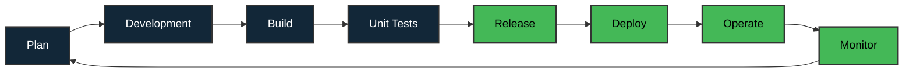
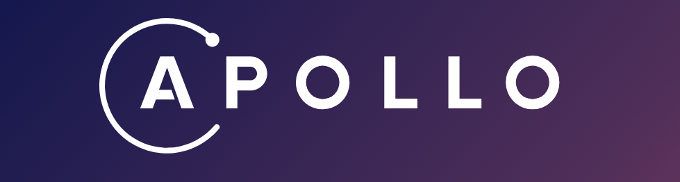
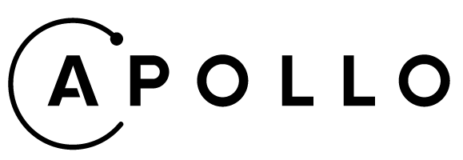
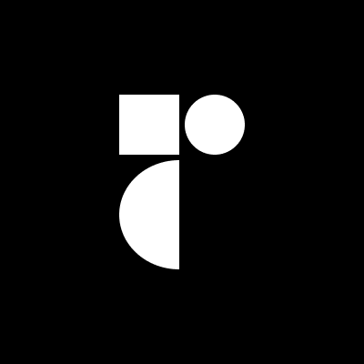
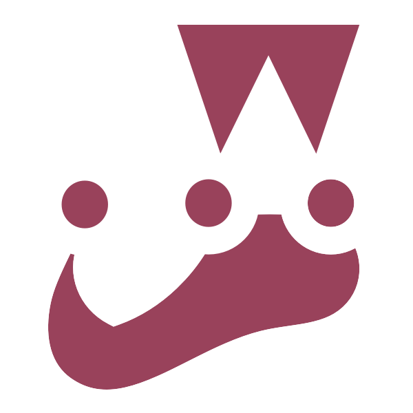
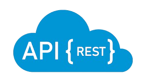
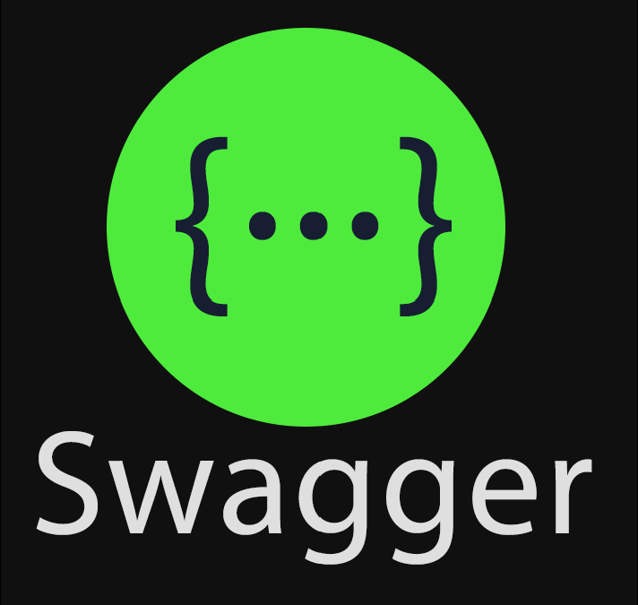
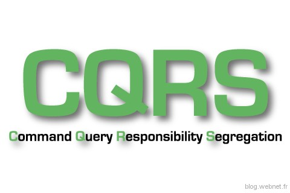
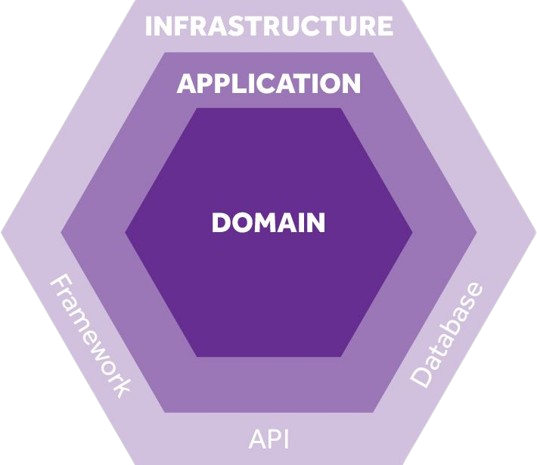

<h1 align="center" style="text-align: center;">Hi 👋, I'm Davy ROBERT from Lyon city in France</h1>
<h3 align="center" style="text-align: center; font-weight: bold">Web Developer Full Stack in progress</h3>

<!-- 
 

 -->

 

Feel free to visit my <strong><u>Portfolio</u></strong> by clicking below <strong>`(does'nt work but hosting in progress)`</strong> :
 

 Today, if you are a recruiter, come across this profile and are looking for a web developer with skills could match with me, feel free to contact me via my <strong>Linkedin </strong>link you'll find <a href="#contact">below</a> to find out more about my profile. 
 

<h2 id="contact">✉️ Connect with me :</h2>

<!--  -->

We'll talk about the various projects I've been able to carry out to date. 

I'm currently learning and improving my skills in Continuous Integration and Continuous Delivery to feel more comfortable.
I'm also training to host my different projects on a web server.

- 💬 Ask me about **NextJS, NodeJS, ReactJS** but also **Angular, .NET / C# or Java / Kotlin**  for Android mobile App.

- If you haven't visited my portfolio just at the top, you will find a part of my whole projects below where I've provided some shortcuts. Take a look at them <strong><u>`(does'nt work but hosting in progress)`</u></strong> :   
[Project 1](https://github.com/DavyR01) 〰
[Project 2](https://github.com/DavyR01) 〰
[Project 3](https://github.com/DavyR01)

  <!-- - I am currently learning on : -->

- I'm used to working on each of my projects using the [**Scrum Agile Method**](https://asana.com/fr/resources/sprint-planning-meeting).
  The following diagram shows the sprint cycle according to the Devops approach :
    

  

<!-- 
   -->

# ⚒️ Tech Stacks :

 
Below are the stacks I've already used in some of the projects I've contributed to or performed during my professional career.

### LANGUAGES :
   
   
   

   

   

   

     

### FRONTEND Development :

   <a align="left" href="https://nextjs.org/">
      &nbsp;&nbsp;&nbsp;
   </a>
   <a align="left" href="https://reactjs.org/">
      &nbsp;&nbsp;&nbsp;
   </a>
   <a align="left" href="https://www.apollographql.com/docs/apollo-server#gh-dark-mode-only">
      &nbsp;&nbsp;&nbsp;
   </a>
   <a align="left" href="https://www.apollographql.com/docs/apollo-server#gh-light-mode-only">
      &nbsp;&nbsp;&nbsp;
   </a>
   <a align="left" href="https://vitejs.dev/">
      &nbsp;&nbsp;&nbsp;
   </a>

  

  

### BACKEND Development :

   <a align="left" href="https://expressjs.com#gh-dark-mode-only">
       &nbsp;&nbsp;&nbsp;
   </a>
   <a align="left" href="https://expressjs.com#gh-light-mode-only">
       &nbsp;&nbsp;&nbsp;
   </a>
   <a align="left" href="https://raw.githubusercontent.com/devicons/devicon/master/icons/nodejs/nodejs-original-wordmark.svg">
       &nbsp;&nbsp;
   </a>

   <a align="left" href="https://typegraphql.com/">
       &nbsp;&nbsp;&nbsp;
   </a>
   <a align="left" href="https://www.apollographql.com/docs/apollo-server#gh-dark-mode-only">
       &nbsp;&nbsp;&nbsp;
   </a>
   <a align="left" href="https://www.apollographql.com/docs/apollo-server#gh-light-mode-only">
       &nbsp;&nbsp;&nbsp;
   </a>

  

### UNITS TESTING :

  

  

### DATABASE :

  

### API :

  

### TOOLS :

  

  

### INFRASTRUCTURES :

  

  

### PROJECT MANAGEMENT :

  

### SOCIAL NETWORKS :

  

### PATTERNS & ARCHITECTURES :

  

### UI / UX DESIGN :

  

   
# 📊 Some Github Statistics :

I would like to point out that I didn't just use github for my whole project, especially in the corporate world. 

But I'm also used to working with Gitlab, Azure Dev Ops or Bitbucket for instance.

# Mon Profil GitHub

## Statistiques des Langages

## Statistiques de la Série

## Statistiques GitHub

