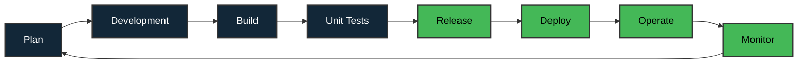

<h1 align="center" style="text-align: left;">Salut 👋, moi c'est Davy ROBERT</h1>
<h2 align="center" style="text-align: left; font-weight: bold">Concepteur Développeur d'Applications Web & Mobile 🔎</h2>

<!-- 
 

 -->

 

Venez faire un tour sur mon <strong><u>Portfolio</u></strong> :
 

 Vous recherchez un développeur web ? Si vous êtes un recruteur, que vous naviguez sur ce profil et , n'hésitez pas à me contacter via mon lien <strong>Linkedin </strong>que vous trouverez <a href="#contact">ci-dessous</a> pour en savoir plus sur mon profil. 
 

## ⚒️ Stacks techniques
 
Ci-dessous se trouvent les stacks que j'ai déjà utilisées dans certains des projets auxquels j'ai contribué ou réalisés pendant ma carrière professionnelle.

### Front-end :

### Back-end :

### Base de données :

### Orchestration :

### Utilisés en entreprise :

---

### 🚀 Mes Projets de Sélection :

- 🏢 **[Ecosystem](https://www.davyrobert.fr/fr/projects/ecosystem-qvmd)** - Plateforme de gestion QVMD complète

- 🧠 **[MakeSense](https://www.davyrobert.fr/fr/projects/makesense)** - Application d'analyse sémantique et de compréhension

- 🏠 **[WildRent](https://www.davyrobert.fr/fr/projects/wildrent)** - Platforme de location immobilière moderne

- 💼 **[MyCritJob](https://www.davyrobert.fr/fr/projects/crit-job)** - Application mobile de recherche d'emploi et critique

- ⚡ **[Eurowatt-Super7](https://www.davyrobert.fr/fr/projects/eurowatt-super7)** - Solution de gestion énergétique innovante

- 🎨 **[Virtual Met Art](https://www.davyrobert.fr/fr/projects/virtual-met-art)** - Expérience immersive d'art virtuel et métavers

- 🇫🇷 **[France Trivia Quiz](https://www.davyrobert.fr/fr/projects/france-trivia)** - Jeu de quiz interactif sur la culture française

- 📝 **[Blog Project JS](https://www.davyrobert.fr/fr/projects/blog-project-js)** - Plateforme de blog moderne avec JavaScript

- 👜 **[Louis Vuitton](https://www.davyrobert.fr/fr/projects/louisvuitton)** - Experience digitale de luxe et e-commerce

--- 

## Méthodes et Organisations

J'ai l'habitude de travailler sur chacun de mes projets en utilisant la [**Méthode Agile Scrum**](https://asana.com/fr/resources/sprint-planning-meeting).
  Le diagramme suivant montre le cycle de sprint selon l'approche Devops :
    

  

<!-- 
   -->

---

## 📊 Quelques Statistiques :

Je tiens à souligner que je n'ai pas seulement utilisé github pour tous mes projets, surtout dans le monde de l'entreprise. 

Mais j'ai aussi l'opportunité de travailler avec Gitlab, Azure Dev Ops ou Bitbucket par exemple.

### Statistiques des langages

    
    

### Statistiques de série

    
    

### Statistiques Github

    
    

<h2 id="contact">✉️ Comment me contacter ❓</h2>

Discutons ensemble de la valeur que je peux apporter à vos projets en prenant en compte vos réels besoins. Vous pouvez me contacter sur LinkedIn en m'envoyant un message ou par email.

<!--  -->
