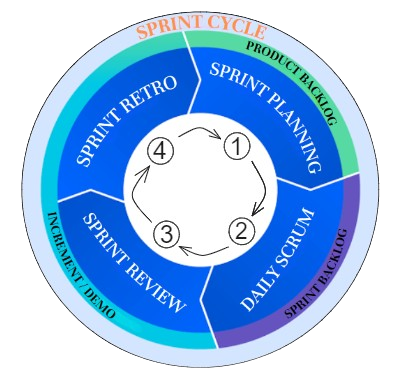
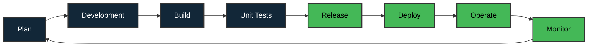

<h1 align="center" style="text-align: left;">Salut 👋, moi c'est Davy ROBERT</h1>
<h2 align="center" style="text-align: left;"><b>💻 Concepteur Développeur d'Applications Web & Mobile</b></h2>

<h2 id="about" style="text-align: left;"><b>📎 A propos</b></h2>
<ul>
<li>🎓 <b>Concepteur Développeur d'Applications</b> (RNCP37873, Niveau 6, +3/4)</li>
<li>🎓 <b>Développeur Web et Web mobile</b> (RNCP37873, Niveau 5, +2)</li>
<li>👉 <b>Ce que j'apporte</b> : 

- La conception d'applications performantes, accessibles et maintenables. 
- Mon goût prononcé pour l'apprentissage, mon envie de contribuer à des projets qui ont du sens, porteurs de transformations avec une véritable utilité. 
- Une vision globale et une capacité d'analyse alignées avec les objectifs métiers et avec la cohérence des solutions développées.
- J'aime aller jusqu'au bout des choses, comprendre et analyser des problématiques, avoir ce sentiment d'accomplissement et faire les choses bien, le tout en prenant soin de m'organiser correctement.</li>

<li>🎯 <b>Mes objectifs</b> : Animé par une curiosité et une véritable volonté d'apprentissage, de découverte et d'exploration, je souhaite relever de nouveaux défis professionnels et techniques. Je recherche une équipe qui partage la même dynamique et une entreprise aux valeurs fortes, dans laquelle je pourrais pleinement m'investir.</li>

<li>🔎 <b>En formation continue</b> et en veille régulière sur les dernières technologies notamment sur :</li>
<h3 align="center" style="text-align: left;"><b>
  
  
  
  
</h3>
<li><b>📌 Disponible pour :</b> CDI / CDD / Portage Salarial</li>
</ul>

 

<h2 style="text-align: left;"><b>🚀 Liens rapides</b></h2>

<ul>
<li><a href="#parcours">✒️ Parcours et Appétences</a></li>
<li><a href="#stacksPredilection">⚒️ Stacks & Outils de prédilection</a></li>
<li><a href="#stacksEntreprise">⚒️ Stacks techniques utilisées en entreprise</a></li>
<li><a href="#projects">🚀 Mes Projets mis en avant</a></li>
<li><a href="#method">🔎 Méthodes & Organisations</a></li>
<li><a href="#stats">📊 Quelques Statistiques</a></li>
<li><a href="#resume">👉 Pour résumer</a></li>
<li><a href="#contact">✉️ Comment me contacter ❓</a></li>
</ul>

<!-- 
 

 -->

---
 

<h2 id="parcours" style="text-align: left;"><b>✒️ Parcours et Appétences</b></h2>

<b>Au cours de mon parcours, les opportunités de mes précédentes missions m'ont orienté a occuper un poste en tant que profil full stack.</b>

Ces expériences m'ont été très enrichissantes et m'ont beaucoup apportées.

 Cependant avec le recul, selon moi, c'est à la fois un avantage mais aussi un inconvénient. 

Car pour exceller dans un domaine, Il faut se spécialiser.

J'aurais aimé et j'aimerais me spécialiser et m'expertiser davantage, par une mise en application concrète et utile, sur une poignée de stacks front et back telles que :

<ul>
  <li><b>Pour le front : </b><b>Next.JS, React, Tailwind CSS</b></li>
  <li><b>Pour le back : </b><b>GraphQL, Node.js, PostgreSQL</b></li>
</ul>

L'ensemble accompagné des outils nécessaires à la constructions d'applications modernes à la fois performantes, scalables et maintenables.

J'ai une forte appétence également pour la création d'applications mobiles : Java, Kotlin, React Native.

Donc si l'opportunité se présente à moi, je suis réellement preneur ! Faites moi signe.

Constamment en veille avec un réel attrait pour l'apprentissage, je me forme régulièrement en autonomie.

Pour avoir une visibilité sur les projets concernés par ces stacks, c'est <a href="#projects"> 👉 ici 👈</a>.

 

<h2 id="stacksPredilection" style="text-align: left; font-weight: bold">⚒️ Stacks & Outils de prédilection</h2>

 
Ci-dessous se trouvent les stacks que j'affectionne tout particulièrement, et que j'ai déjà utilisées dans certains projets auxquels j'ai contribué ou que j'ai réalisés.

 

 

 

 
<!-- Ajouter "&style=flat" pour rendre le logo plus petit --> 

 Pour une vision d'ensemble, retrouvez l'ensemble de ces projets juste <a href="#projects">ici</a>.

 

<h2 id="stacksEntreprise" style="text-align: left; font-weight: bold">⚒️ Stacks techniques utilisées en entreprise</h2>

 
Les technos suivantes sont principalement au coeur des projets auxquels j'ai eu l'opportunité de contribuer jusqu'à présent en entreprise :

  

 Pour une vision d'ensemble, retrouvez l'ensemble de ces projets juste <a href="#projects">ici</a>.

 

<h2 id="projects">🚀 Mes Projets mis en avant :</h2>

- 🏢 **[Ecosystem](https://www.davyrobert.fr/fr/projects/ecosystem-qvmd)** - Plateforme de mise en relation entre prestataires et détenteurs de déchets (Angular, Typescript, .NET, C#)

- 🧠 **[MakeSense](https://www.davyrobert.fr/fr/projects/makesense)** - Application de création de prise de décision pour l'association. Le but étant de passer à l'action et de construire une société inclusive et durable (React, Vite.js, Node.js, MySQL).

- 🏠 **[WildRent](https://www.davyrobert.fr/fr/projects/wildrent)** - Platforme de location d'équipements et d'activité outdoors / indoors (Next.js, Typescript, TailwindCSS, GraphQL). 

- 💼 **[MyCritJob](https://www.davyrobert.fr/fr/projects/crit-job)** - Application mobile de recherche d'emploi et de gestion administrative (Java, Kotlin).

- ⚡ **[Eurowatt-Super7](https://www.davyrobert.fr/fr/projects/eurowatt-super7)** - Solution de gestion énergétique innovante (PHP, Symfony, PostgreSQL).

- 🎨 **[Virtual Met Art](https://www.davyrobert.fr/fr/projects/virtual-met-art)** - Expérience immersive d'art virtuel et métavers (React, Vite.js, TailwindCSS, REST API).
 
- 🇫🇷 **[France Trivia Quiz](https://www.davyrobert.fr/fr/projects/france-trivia)** - Jeu de quiz interactif sur la culture française (Javascript, HTML, CSS).

- 📝 **[Blog Project JS](https://www.davyrobert.fr/fr/projects/blog-project-js)** - Blog moderne de création de post (Javascript, SCSS, Node.js, WebPack).

- 👜 **[Louis Vuitton](https://www.davyrobert.fr/fr/projects/louisvuitton)** - Marque de luxe connue pour ses collections haut de gamme (React, Sharepoint, Webpack).

 

<h2 id="method" style="text-align: left; font-weight: bold">🔎 Méthodes & Organisations</h2>

J'ai l'habitude de travailler sur chacun de mes projets en utilisant la [**Méthode Agile Scrum**](https://asana.com/fr/resources/sprint-planning-meeting).
  Le diagramme suivant que j'ai réalisé montre le cycle de sprint que j'utilise selon l'approche Devops :
    

  

<!-- 
   -->

 

<h2 id="stats" style="text-align: left; font-weight: bold">📊 Quelques Statistiques :</h2>

Je tiens à souligner que je n'ai pas seulement utilisé Github pour tous mes projets, surtout dans le monde de l'entreprise.

J'ai aussi eu l'opportunité de travailler avec Gitlab, Azure Dev Ops, Bitbucket par exemple.

A titre indicatif, ces chiffres et statistiques ne sont pas exhaustifs. Ils ne reflètent qu'une partie du temps passé sur ces technologies.

### 📊 Statistiques

  <table>
    <tr>
      <td width="50%" align="center">
        <h4>Langages les plus utilisés</h4>
        
        
      </td>
      <td width="50%" align="center">
        <h4>Statistiques GitHub</h4>
        
        
      </td>
    </tr>
  </table>

### 🔥 Statistiques de série

    
    

 

<h2 id="resume" style="text-align: left; font-weight: bold">👉 Pour résumer</h2>

 <strong>Vous recherchez un développeur web, un intégrateur web ou un développeur mobile ?</strong>

<i> Discutons ensemble de la valeur que je peux apporter à vos projets en prenant en compte vos réels besoins sur un aspect concret et pragmatique.</i>   

Examinons dans quelle mesure vos critères sont compatibles avec les miens et peuvent correspondre à nos attentes respectives. 

<i>Afin d'illustrer les projets que j'ai réalisés ou auxquels j'ai contribué jusqu'à présent, je vous invite à consulter mon <a href="https://www.davyrobert.fr/">Portfolio</a>.</i>

Pour me joindre, mes coordonnées sont juste en dessous 👇.
 

 

<h2 id="contact" style="text-align: left;"><b>✉️ Comment me contacter ❓</b></h2>

Intéressé par mon profil ?

<b>Je vous donne rendez-vous par message sur mon LinkedIn !</b>

<!-- 

  

 -->
